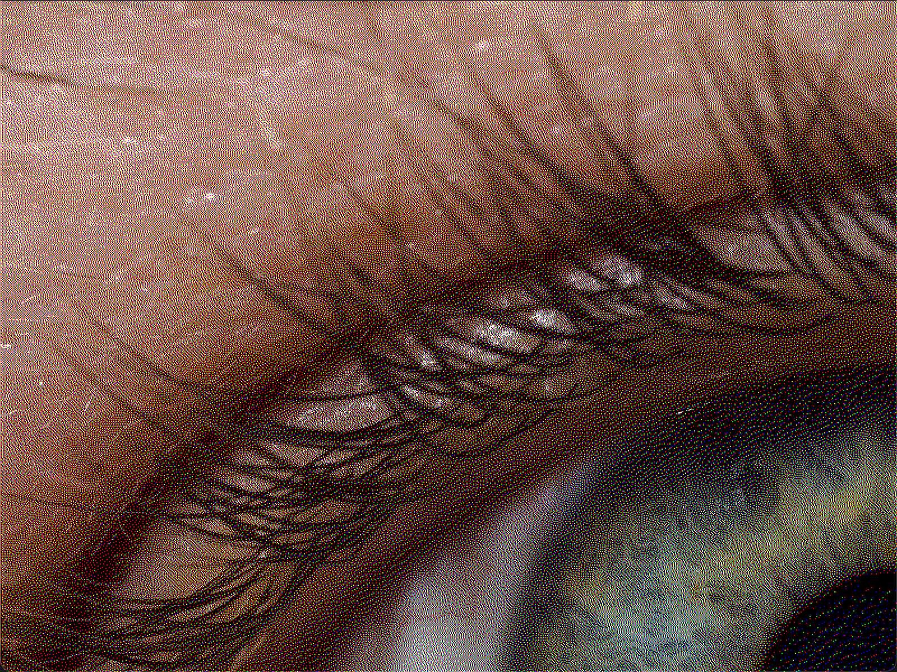
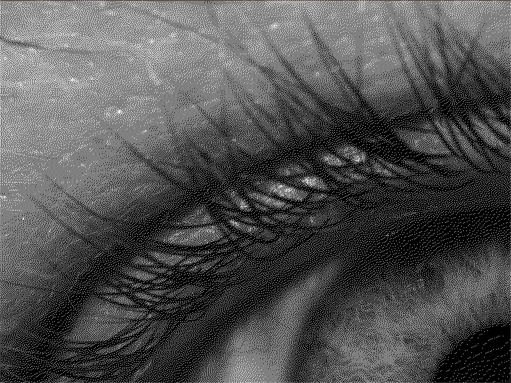

# Floyd Steinberg Dithering

This is a simple implementation of the Floyd Steinberg dithering algorithm in Lua using the [LÖVE](https://love2d.org/) framework.

# Dependencies

- [LÖVE](https://love2d.org/)

# Usage

In the root directory of the project, run:
```bash
love . input_file <string> gray_scale <bool>
```

## Original

</img>

## Color Dithered

</img>

## Grayscale Dithered

</img>